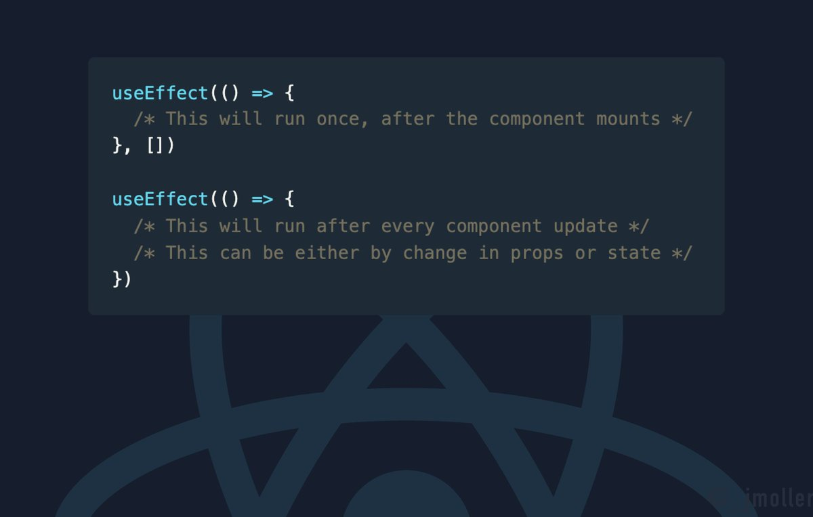
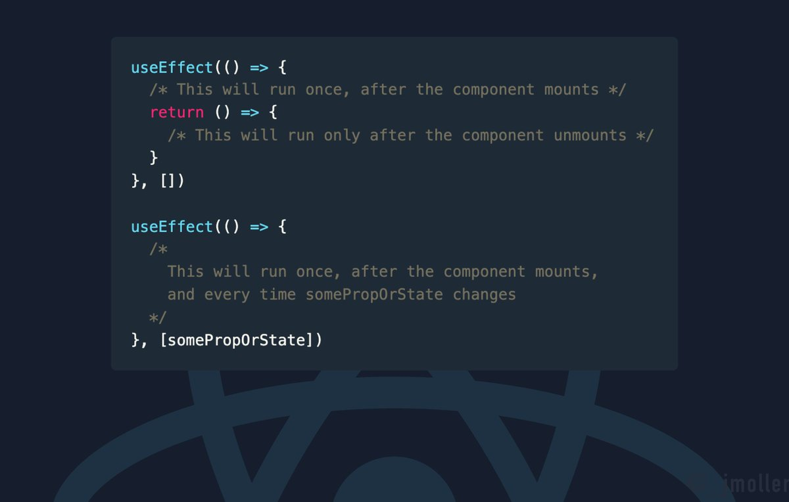
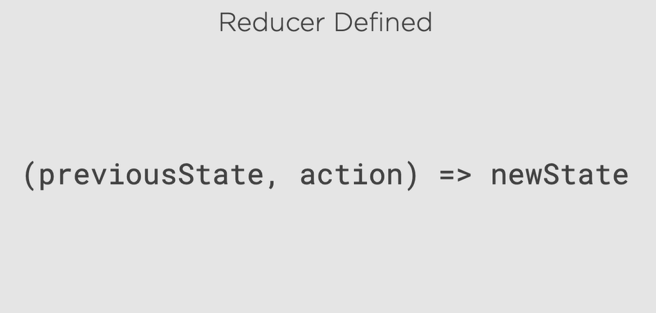
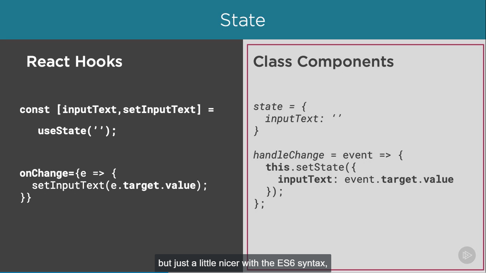
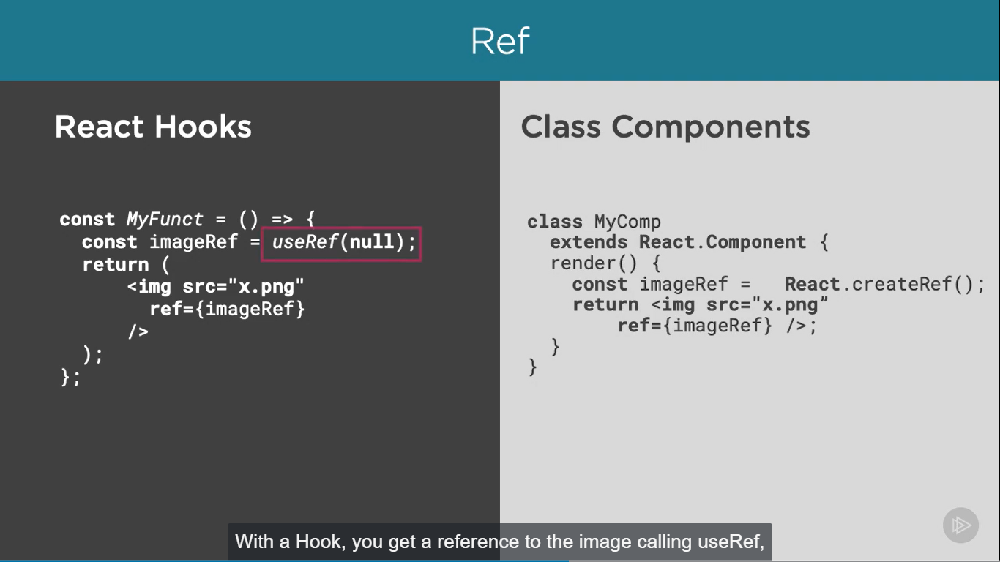
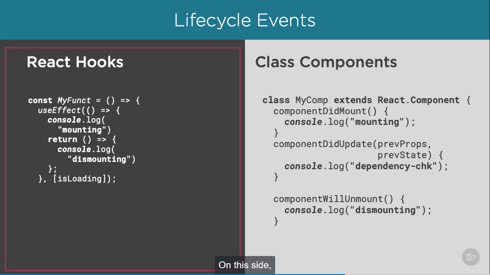
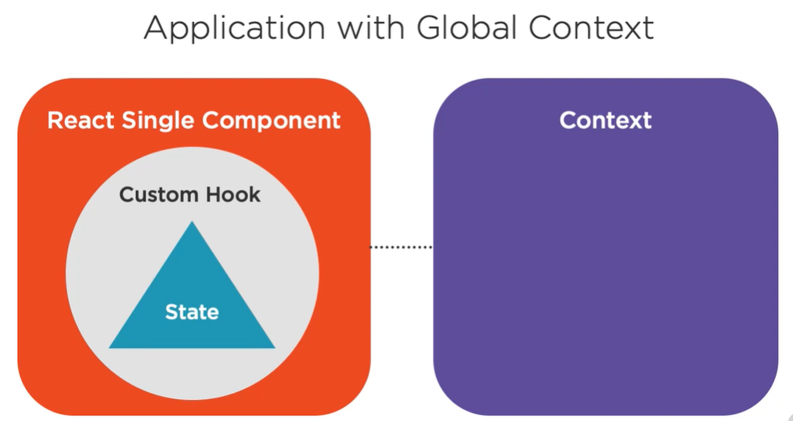
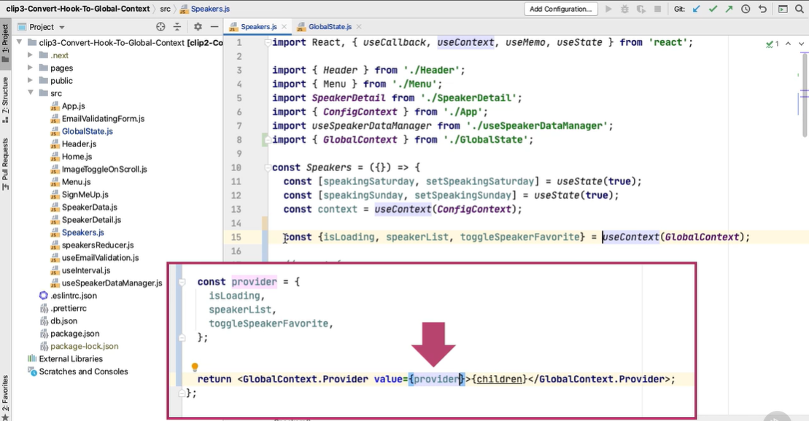

# React Hooks Pluralsight

## What are React Hooks?

React Hooks adds the ability to manage React state and interface with React lifecycle events in React functional components.

Basically, it's React's way of allowing you to attach reusable logic to an existing component. Before Hooks, the most common way to attach logic externally to a component was to use the render props or higher‑order components pattern. Often, that led to awkward restructuring of your code that made it both cumbersome and harder to follow. React Hooks solves this problem by creating a mechanism for you to extract code that you can reuse between components. It does it without introducing any unnecessary nesting in your component tree.

React Hooks are JavaScript functions that allow developers to use state and lifecycle methods inside React functional components. With React Hooks, you can now build 100% of your application without using JavaScript classes at all. You never have to worry about the keyword "this" again.

## useState

The idea is, basically, every time the users see something new on the screen, it's tracked as a new state. The simplest example of this is what happens when a browser user types into an input field. Each character the user types fires an event, and that event replaces the current value of what is currently stored in state with a new value. Both the old state and the new state values are maintained, making development and debugging easy.

```javascript
import React, { useState } from "react";

const inputElement = () => {
  // const results = useState("");
  // const inputText = results[0];
  // const setInputText = results[1];

  const [inputText, setInputText] = useState("");
  const [historyList, setHistoryList] = useState([]);

  return (
    <div>
      <input
        onChange={(e) => {
          setInputText(e.target.value);
          setHistoryList([...historyList, e.target.value]);
        }}
        placeholder="Enter some text"
      />
      <p>{inputText}</p>
      <hr />
      <p>
        {historyList.map((historyWord) => {
          return <div>{historyWord}</div>;
        })}
      </p>
    </div>
  );
};

export default inputElement;
```

## useRef

It is primmarily used to allow direct access to an element in the DOM.

```javascript
// Both files are considered to be react component.

// ImageChangeOnMouseHover.js file

import React from "react";
import ImageToggleOnMouseHover from "../src/ImageToggleOnMouseHover";
const ImageChangeOnMouseHover = () => {
  return (
    <div>
      <ImageToggleOnMouseHover
        primaryImg="/static/speakers/bw/Speaker-187.jpg"
        secondaryImg="/static/speakers/Speaker-187.jpg"
        alt=""
      />
      &nbsp;&nbsp;&nbsp;
      <ImageToggleOnMouseHover
        primaryImg="/static/speakers/bw/Speaker-1124.jpg"
        secondaryImg="/static/speakers/Speaker-1124.jpg"
        alt=""
      />
    </div>
  );
};

export default ImageChangeOnMouseHover;


// ImageToggleOnMouseHover.js file

import React, { useRef } from "react";

const ImageToggleOnMouseHover = ({ primaryImg, secondaryImg }) => {
  const imageRef = useRef(null);


  return (
     {
        imageRef.current.src = secondaryImg;
      }}
      onMouseOut={() => {
        imageRef.current.src = primaryImg;
      }}
      src={primaryImg}
      alt=""
      ref={imageRef}
    />
  );
};

export default ImageToggleOnMouseHover;
```

## useEffect





## useContext

A new Context API whose purpose is to make accessing data and functions anyplace in your app very simple and straightforward.

The new React Hook useContext makes it trivial to access context in any of your functional components without any unnatural acts, that is, creating wrapping tags in your render events that literally have nothing to do with the UI become obsolete.

**Issues Solved**:

1. Passed properties around your component up and down complex component trees. It was ugly.
2. It led to the design pattern commonly used known as prop drilling and also to HOC, higher‑order components, to basically use class inheritance as a way to pass data around, equally ugly and troublesome.

```javascript
// Initially our code looks like this

const App = ({ pageName }) => {
  if (pageName === "Home") return <Home />;
  if (pageName === "Speakers") return <Speakers />;
  return <div>Not Found</div>;
};

export default App;

// After refactoring and adding context
import React from "react";
import Home from "./Home";
import Speakers from "./speakers";

// 1. create a context and export it. That way, other components can just import the context to use it
export const ConfigContext = React.createContext();

const pageToShow = (pageName) => {
  if (pageName === "Home") return <Home />;
  if (pageName === "Speakers") return <Speakers />;
  return <div>Not Found</div>;
};

const configValue = {
  showSpeakerSpeakingDays: true,
};

const App = ({ pageName }) => {
  return (
    // 2. next is in our return of our app component, we wrap our page to show with ConfigContext.Provider. Then we pass the attributes value to the provider, which can be any JavaScript object. We'll assign that to the value attribute of the ConfigContext.Provider.
    <ConfigContext.Provider value={configValue}>
      <div>{pageToShow(pageName)}</div>
    </ConfigContext.Provider>
  );
};

export default App;

// Theoretically, we plan on being able to access that value from any component that's below this component app.
```

## useReducer



Reducer is simply a function that takes in a previous state as the first parameter, an action as the second parameter, and returns a new state.

useState is built on useReducer.

```javascript
// useState is build on useReducer -> Proof

const [speakerList, setSpeakerList] = useState([]);
                  |
                  v
const [speakerList, setSpeakerList] = useReducer(
  (state, action) => action,
  []
);
```

### More briefly explained

```javascript
function speakersReducer(state, action) {
  switch (action.type) {
    case "setSpeakerList": {
      return action.data;
    }
    default:
      return state;
  }
}
// 1.  useReducer does for us here is that when we call dispatch,
// the useReducer code calls speakersReducer on our behalf.
// You could think of calling dispatch as the same thing as calling the function speakersReducer in this case.
const [speakerList, dispatch] = useReducer(speakersReducer, []);

// 4. think of this as useState is just useReducer with only a default action type

const [isLoading, setIsLoading] = useState(true);
const [speakingSat, setSpeakingSat] = useState(true);
const [speakingSun, setSpeakingSun] = useState(true);

// Usinf useContext get a reference to our ConfigContext
const context = useContext(ConfigContext);

useEffect(() => {
  setIsLoading(true);
  new Promise((resolve) => {
    setTimeout(() => {
      resolve();
    }, 1000);
  }).then(() => {
    setIsLoading(false);
  });
  // setSpeakerList(SpeakerData);
  // 2. we need to update the function call to setSpeakerList with the call to
  // dispatch with the first parameter being an object with the attribute type
  // set to setSpeakerList and the data set to our array that contains all the
  // speakers. This matches with our reducer. So when the reducer gets called
  // by the dispatch method, the new state is returned.
  dispatch(
    // 3. This is an action object which we are refering above in switch statement
    {
      type: "setSpeakerList",
      data: SpeakerData,
    }
  );
  return () => {
    console.log("clean up");
  };
}, []);
```

**reducer with further more actions**

```javascript
function speakersReducer(state, action) {
  function updateFavorite(favoriteValue) {
    return state.map((item) => {
      if (item.id === action.sessionId) {
        return { ...item, favorite: favoriteValue };
      }
      return item;
    });
  }

  switch (action.type) {
    case "setSpeakerList": {
      return action.data;
    }
    case "favorite": {
      return updateFavorite(true);
      // return state.map((item) => {
      //   if (item.id === action.sessionId) {
      //     item.favorite = true;
      //   }
      //   return item;
      // })
    }
    case "unfavorite": {
      return updateFavorite(false);
    }
    default:
      return state;
  }
}

const [speakerList, dispatch] = useReducer(speakersReducer, []);

const [isLoading, setIsLoading] = useState(true);
const [speakingSat, setSpeakingSat] = useState(true);
const [speakingSun, setSpeakingSun] = useState(true);

// Usinf useContext get a reference to our ConfigContext
const context = useContext(ConfigContext);

useEffect(() => {
  setIsLoading(true);
  new Promise((resolve) => {
    setTimeout(() => {
      resolve();
    }, 1000);
  }).then(() => {
    setIsLoading(false);
  });
  // setSpeakerList(SpeakerData);
  dispatch({
    type: "setSpeakerList",
    data: SpeakerData,
  });
  return () => {
    console.log("clean up");
  };
}, []);

const handleChangeSaturday = () => {
  setSpeakingSat(!speakingSat);
};

const handleChangeSunday = () => {
  setSpeakingSun(!speakingSun);
};

const speakerListFiltered = isLoading
  ? []
  : speakerList
      .filter(({ sat, sun }) => (speakingSat && sat) || (speakingSun && sun))
      .sort((a, b) => {
        if (a.firstName < b.firstName) {
          return -1;
        }
        if (a.firstName > b.firstName) {
          return 1;
        }
        return 0;
      });

const heartFavoriteHandler = (event, favoriteValue) => {
  event.preventDefault();
  const sessionId = parseInt(event.target.attributes["data-sessionId"].value);
  // setSpeakerList(
  //   speakerList.map((item) => {
  //     if (item.id === sessionId) {
  //       return { ...item, favorite: favoriteValue };
  //     }
  //     return item;
  //   })
  // );

  dispatch({
    type: favoriteValue === true ? "favorite" : "unfavorite",
    sessionId: sessionId,
  });
};
```

Refer theory above

## useCallback and useMemo

**Memoizing**

Wiki - In computing, memoization or memoisation is an optimization technique used primarily to speed up  
computer programs by storing the results of expensive function calls and returning the cached result when  
the same inputs occur again.

useCallback - caches a function

useMemo - caches a value

### useCallback

```javascript
// Speakers.js file where we are handling the event heartFavoriteHandler

//  If we look how we call the heartFavoriteHandler, notice that every time the page renders,
// we pass the handler to the SpeakerDetail page. React doesn't know that that function is
// not changing, so it re‑renders that component again just in case. The good news is we can
// add the useCallback Hook to the React import, then we wrap our function with useCallback,
// and the return of useCallback essentially caches that function value.

const heartFavoriteHandler = useCallback((event, favoriteValue) => {
  event.preventDefault();
  const sessionId = parseInt(event.target.attributes["data-sessionId"].value);
  // setSpeakerList(
  //   speakerList.map((item) => {
  //     if (item.id === sessionId) {
  //       return { ...item, favorite: favoriteValue };
  //     }
  //     return item;
  //   })
  // );

  dispatch({
    type: favoriteValue === true ? "favorite" : "unfavorite",
    sessionId: sessionId,
  });
}, []);

// SpeakerDetail.js file where the above event Handler is called.
<button
  data-sessionId={id}
  className={favorite ? "heartredbutton" : "heartdarkbutton"}
  onClick={(event) => {
    onHeartFavoriteHandler(event, !favorite);
  }}
/>;
```

# Takeaways

**UseState** - lets us track state really easily with very little ceremony.

**UseEffect** - gives us a clean way to set things, typically state, when components start and finish.

**useRef** - gives us the control we need to get to DOM elements when other means are not quite so straightforward.

**useContext** - That gave us the ability to pass data, config data in our example, down the component tree without prop drilling.

**useReducer** - gave us a nice way to organize our state management.

**useCallback** - gave us a nice performance gain by not having all our speaker detail pages have to re‑render on every button click of any speaker.

**useMemo** - to cache some data on our client, saving some compute time on our app, and hopefully making it more responsive in the process.

# Functional vs Class component

## useState




## useRef




## useEffect




# Creating Custom hooks

```javascript
// Before Refactoring

// EmailValidaingForm.js - file - before
import React, { useReducer, useState } from "react";
import useInterval from "./useInterval";

function EmailValidatingForm() {
  // 1. we have a validateEmail function that uses a regex expression to validate an email address.
  const validateEmail = (email) => {
    const re =
      /^(([^<>()[\]\\.,;:\s@\"]+(\.[^<>()[\]\\.,;:\s@\"]+)*)|(\".+\"))@((\[[0-9]{1,3}\.[0-9]{1,3}\.[0-9]{1,3}\.[0-9]{1,3}\])|(([a-zA-Z\-0-9]+\.)+[a-zA-Z]{2,}))$/;

    return re.test(email);
  };
  // 2. Then, we declare with useState a boolean that defaults our emailValid state to false. That's because we will start with an empty text string, which is not a valid email.
  const [emailValid, setEmailValid] = useState(false);

  const emailReducer = (state, action) => {
    const isValidEmail = validateEmail(action);
    setEmailValid(isValidEmail);
    return action;
  };
  // 3. Then, we create our email state. But instead of using useState, we create a simple reducer using useReducer. By replacing useState with useReducer, our first parameter to useReducer is now the reducer function named emailReducer. And the second parameter is the initial value of the associated state.
  // 4. Issue if we used useState is that we won't be able to validate the email. Since we will be just using setEmail to set email's state and further not validating it on the go. which is what we want.
  // With the help of the reducer we are using the setEmailValid and we are updating the state of the email after validating. And both the states are in sync.
  const [email, setEmail] = useReducer(emailReducer, "");

  const maxSeconds = 30;

  const [count, setCount] = useState(maxSeconds);

  useInterval(() => {
    setCount(count - 1);
  }, 1000);

  return (
    <div className="container">
      <br />
      <div>
        <div className="content">
          <input
            onChange={(e) => {
              setEmail(e.target.value);
            }}
            disabled={count <= 0}
            value={email}
            placeholder="Enter Email"
            type="email"
            name="email"
            required
          />
          &nbsp;&nbsp;&nbsp;
          <button
            disabled={!emailValid || count <= 0}
            onClick={() => {
              setCount(0);
              alert(`button clicked with email ${email}`);
            }}
            className="btn-lg"
            type="submit"
          >
            PRESS ME!
          </button>
          <div>{count > 0 ? `You Have ${count} Seconds To Enter Your Email` : "Email Entered or Time Expired"}</div>
        </div>
      </div>
    </div>
  );
}

export default EmailValidatingForm;

/////////////////////////////////////----------------------------/////////////////////////////////////

// After refactoring to different files

// useEmailValidatingForm.js -> custom hook

import React, { useReducer, useState } from "react";
import useInterval from "./useInterval";

function useEmailValidation(seconds) {
  // 1. we have a validateEmail function that uses a regex expression to validate an email address.
  const validateEmail = (email) => {
    const re =
      /^(([^<>()[\]\\.,;:\s@\"]+(\.[^<>()[\]\\.,;:\s@\"]+)*)|(\".+\"))@((\[[0-9]{1,3}\.[0-9]{1,3}\.[0-9]{1,3}\.[0-9]{1,3}\])|(([a-zA-Z\-0-9]+\.)+[a-zA-Z]{2,}))$/;

    return re.test(email);
  };
  // 2. Then, we declare with useState a boolean that defaults our emailValid state to false. That's because we will start with an empty text string, which is not a valid email.
  const [emailValid, setEmailValid] = useState(false);

  const emailReducer = (state, action) => {
    const isValidEmail = validateEmail(action);
    setEmailValid(isValidEmail);
    return action;
  };
  // 3. Then, we create our email state. But instead of using useState, we create a simple reducer using useReducer. By replacing useState with useReducer, our first parameter to useReducer is now the reducer function named emailReducer. And the second parameter is the initial value of the associated state.
  // 4. Issue if we used useState is that we won't be able to validate the email. Since we will be just using setEmail to set email's state and further not validating it on the go. which is what we want.
  // With the help of the reducer we are using the setEmailValid and we are updating the state of the email after validating. And both the states are in sync.
  const [email, setEmail] = useReducer(emailReducer, "");

  const maxSeconds = 30;

  const [count, setCount] = useState(maxSeconds);

  useInterval(() => {
    setCount(count - 1);
  }, 1000);

  return {
    setEmail,
    count,
    email,
    emailValid,
    setCount,
  };
}

export default useEmailValidation;

// EmailValidatingForm.js -> file -> after refactoring

import React from "react";
import useEmailValidation from "./useEmailValidation";

function EmailValidatingForm() {
  const { setEmail, count, email, emailValid, setCount } =
    useEmailValidation(30);

  return (
    <div className="container">
      <br />
      <div>
        <div className="content">
          <input
            onChange={(e) => {
              setEmail(e.target.value);
            }}
            disabled={count <= 0}
            value={email}
            placeholder="Enter Email"
            type="email"
            name="email"
            required
          />
          &nbsp;&nbsp;&nbsp;
          <button
            disabled={!emailValid || count <= 0}
            onClick={() => {
              setCount(0);
              alert(`button clicked with email ${email}`);
            }}
            className="btn-lg"
            type="submit"
          >
            PRESS ME!
          </button>
          <div>
            {count > 0
              ? `You Have ${count} Seconds To Enter Your Email`
              : "Email Entered or Time Expired"}
          </div>
        </div>
      </div>
    </div>
  );
}

export default EmailValidatingForm;
```

**Problem**

Below we are calling the dispatch function, though we are calling dispatch, we are passing action object in the heartFavoriteHandler function, which is not a good practice.

```javascript

// Speaker.js file before refactoring

import React, { useState, useContext, useCallback, useMemo } from "react";
import { Header } from "./Header";
import { Menu } from "./Menu";
import SpeakerDetail from "./SpeakerDetail";
import { ConfigContext } from "./App";
import useSpeakerDataManager from "./useSpeakerDataManager";

const Speakers = () => {
  // const [isLoading, setIsLoading] = useState(true);
  const [speakingSat, setSpeakingSat] = useState(true);
  const [speakingSun, setSpeakingSun] = useState(true);

  // Using useContext get a reference to our ConfigContext
  const context = useContext(ConfigContext);

  const { isLoading, speakerList, dispatch } = useSpeakerDataManager();

  const handleChangeSaturday = () => {
    setSpeakingSat(!speakingSat);
  };

  const handleChangeSunday = () => {
    setSpeakingSun(!speakingSun);
  };

  const newSpeakerList = useMemo(
    () =>
      speakerList
        .filter(({ sat, sun }) => (speakingSat && sat) || (speakingSun && sun))
        .sort((a, b) => {
          if (a.firstName < b.firstName) {
            return -1;
          }
          if (a.firstName > b.firstName) {
            return 1;
          }
          return 0;
        }),
    [speakingSun, speakingSat, speakerList]
  );

  const speakerListFiltered = isLoading ? [] : newSpeakerList;

  // Looking at our heartFavoriteHandler, this is basically unchanged since it just calls dispatch and doesn't update either our isLoading or speakerList state directly. We did rename sessionId to id.
  const heartFavoriteHandler = useCallback((event, favoriteValue) => {
    event.preventDefault();
    const sessionId = parseInt(event.target.attributes["data-sessionId"].value);
    dispatch({
      type: favoriteValue === true ? "favorite" : "unfavorite",
      id: sessionId,
    });
    // setSpeakerList(
    //   speakerList.map((item) => {
    //     if (item.id === sessionId) {
    //       return { ...item, favorite: favoriteValue };
    //     }
    //     return item;
    //   })
    // );
  }, []);

  if (isLoading) return <div>Loading...</div>;

  return (
    <div>
      <Header />
      <Menu />
      <div className="container">
        <div className="btn-toolbar margintopbottom5 checkbox-bigger">
          {/* This will display / not display depending on the context mentioned in the app file. */}
          {context.showSpeakerSpeakingDays === false ? null : (
            <div className="hide">
              <div className="form-check-inline">
                <label className="form-check-label">
                  <input
                    type="checkbox"
                    className="form-check-input"
                    onChange={handleChangeSaturday}
                    checked={speakingSat}
                  />
                  Saturday Speaker
                </label>
              </div>
              <div className="form-check-inline">
                <label className="form-check-label">
                  <input
                    type="checkbox"
                    className="form-check-input"
                    onChange={handleChangeSunday}
                    checked={speakingSun}
                  />
                  Sunday Speaker
                </label>
              </div>
            </div>
          )}
        </div>
        <div className="row">
          <div className="card-deck">
            {speakerListFiltered.map(
              ({ id, firstName, lastName, bio, favorite }) => {
                return (
                  <SpeakerDetail
                    key={id}
                    id={id}
                    favorite={favorite}
                    firstName={firstName}
                    lastName={lastName}
                    bio={bio}
                    onHeartFavoriteHandler={heartFavoriteHandler}
                  />
                );
              }
            )}
          </div>
        </div>
      </div>
    </div>
  );
};

export default Speakers;

///////////////////////////////-------------------------------///////////////////////////////

// Speakers.js file

import React, { useState, useContext, useCallback, useMemo } from "react";
import { Header } from "./Header";
import { Menu } from "./Menu";
import SpeakerDetail from "./SpeakerDetail";
import { ConfigContext } from "./App";
import useSpeakerDataManager from "./useSpeakerDataManager";

const Speakers = () => {
  // const [isLoading, setIsLoading] = useState(true);
  const [speakingSat, setSpeakingSat] = useState(true);
  const [speakingSun, setSpeakingSun] = useState(true);

  // Using useContext get a reference to our ConfigContext
  const context = useContext(ConfigContext);

  const { isLoading, speakerList, toggleSpeakerFavorite } =
    useSpeakerDataManager();

  const handleChangeSaturday = () => {
    setSpeakingSat(!speakingSat);
  };

  const handleChangeSunday = () => {
    setSpeakingSun(!speakingSun);
  };

  const newSpeakerList = useMemo(
    () =>
      speakerList
        .filter(({ sat, sun }) => (speakingSat && sat) || (speakingSun && sun))
        .sort((a, b) => {
          if (a.firstName < b.firstName) {
            return -1;
          }
          if (a.firstName > b.firstName) {
            return 1;
          }
          return 0;
        }),
    [speakingSun, speakingSat, speakerList]
  );

  const speakerListFiltered = isLoading ? [] : newSpeakerList;

  // refactoring
  const heartFavoriteHandler = useCallback((event, speakerRec) => {
    event.preventDefault();
    toggleSpeakerFavorite(speakerRec);
  }, []);

  if (isLoading) return <div>Loading...</div>;

  return (
    <div>
      <Header />
      <Menu />
      <div className="container">
        <div className="btn-toolbar margintopbottom5 checkbox-bigger">
          {/* This will display / not display depending on the context mentioned in the app file. */}
          {context.showSpeakerSpeakingDays === false ? null : (
            <div className="hide">
              <div className="form-check-inline">
                <label className="form-check-label">
                  <input
                    type="checkbox"
                    className="form-check-input"
                    onChange={handleChangeSaturday}
                    checked={speakingSat}
                  />
                  Saturday Speaker
                </label>
              </div>
              <div className="form-check-inline">
                <label className="form-check-label">
                  <input
                    type="checkbox"
                    className="form-check-input"
                    onChange={handleChangeSunday}
                    checked={speakingSun}
                  />
                  Sunday Speaker
                </label>
              </div>
            </div>
          )}
        </div>
        <div className="row">
          <div className="card-deck">
            {speakerListFiltered.map((speakerRec) => {
              return (
                <SpeakerDetail
                  key={speakerRec.id}
                  speakerRec={speakerRec}
                  onHeartFavoriteHandler={heartFavoriteHandler}
                />
              );
            })}
          </div>
        </div>
      </div>
    </div>
  );
};

export default Speakers;

// useSpeakerDataManager.js file

import React, { useReducer, useEffect } from "react";
import speakersReducer from "./speakersReducer";
import SpeakerData from "./SpeakerData";

function useSpeakerDataManager() {
  const [{ isLoading, speakerList }, dispatch] = useReducer(
    speakersReducer,
    {
      isLoading: true,
      speakerList: [],
    }
  );

  function toggleSpeakerFavorite(speakerRec) {
    speakerRec.favorite === true
      ? dispatch({ type: "unfavorite", id: speakerRec.id })
      : dispatch({ type: "favorite", id: speakerRec.id });
  }

  useEffect(() => {
    new Promise((resolve) => {
      setTimeout(() => {
        resolve();
      }, 1000);
    }).then(() => {
      dispatch({
        type: "setSpeakerList",
        data: SpeakerData,
      });
    });
    return () => {
      console.log("clean up");
    };
  }, []);

  return { isLoading, speakerList, toggleSpeakerFavorite };
}

export default useSpeakerDataManager;

// SpeakerDetail.js file

import React from "react";
import ImageToggleOnScroll from "./ImageToggleOnScroll";

const SpeakerDetail = ({ speakerRec, onHeartFavoriteHandler }) => {
  const { id, firstName, lastName, bio, favorite } = speakerRec;
  console.log(`Speaker details: ${id} ${firstName} ${lastName} ${favorite}`);
  return (
    <div className="card col-4 cardmin">
      <ImageToggleOnScroll
        className="card-img-top"
        primaryImg={`/static/speakers/bw/Speaker-${id}.jpg`}
        secondaryImg={`/static/speakers/Speaker-${id}.jpg`}
        alt={`${firstName} ${lastName}`}
      />
      <div className="card-body">
        <h4 className="card-title">
          <button
            className={favorite ? "heartredbutton" : "heartdarkbutton"}
            onClick={(event) => {
              onHeartFavoriteHandler(event, speakerRec);
            }}
          />
          <span>
            {firstName} {lastName}
          </span>
        </h4>
        <span>{bio}</span>
      </div>
    </div>
  );
};

export default React.memo(SpeakerDetail);
```

# Server Side rendering

```javascript
// before refactoring

import React from "react";
import App from "../src/App";

function speakers() {
  return <App pageName="Speakers" />;
}

export default speakers;

////////////////--------------////////////////

// after refactoring

import React from "react";
import App from "../src/App";
import path from "path";
import fs from "fs";

export const InitialSpeakerDataContext = React.createContext();

export async function getServerSideProps() {
  // Ultimately, what's returned from this method that's running on the Next.js
  // server is a JavaScript object with a props property. Typically, the first
  // thing that happens when the server method is called is that all external
  // dependencies for this user's web page need to be fulfilled. Typically, those
  // are things like database calls, calls to external services, like REST calls,
  // or any other request dependency. Then the results of those external calls are
  // returned as prop objects.

  const { promisify } = require("util");
  const readFile = promisify(fs.readFile);
  const jsonData = path.resolve("./", "db.json");
  let initialSpeakerData;
  try {
    const readFileData = await readFile(jsonData);
    initialSpeakerData = JSON.parse(readFileData).speakers;
  } catch (error) {
    console.log("/api/speakers error:", error);
  }

  return { props: { initialSpeakerData } };
}

function speakers({ initialSpeakerData }) {
  return (
    <InitialSpeakerDataContext.Provider value={initialSpeakerData}>
      <App pageName="Speakers" />
    </InitialSpeakerDataContext.Provider>
  );
}

export default speakers;

////////////////////// speaker.js file //////////////////////

import React, { useState, useContext, useCallback, useMemo } from "react";
import { Header } from "./Header";
import { Menu } from "./Menu";
import SpeakerDetail from "./SpeakerDetail";
import { ConfigContext } from "./App";
import useSpeakerDataManager from "./useSpeakerDataManager";

const Speakers = () => {
  // const [isLoading, setIsLoading] = useState(true);
  const [speakingSat, setSpeakingSat] = useState(true);
  const [speakingSun, setSpeakingSun] = useState(true);

  // Using useContext get a reference to our ConfigContext
  const context = useContext(ConfigContext);

  const { isLoading, speakerList, toggleSpeakerFavorite } =
    useSpeakerDataManager();

  const handleChangeSaturday = () => {
    setSpeakingSat(!speakingSat);
  };

  const handleChangeSunday = () => {
    setSpeakingSun(!speakingSun);
  };

  const newSpeakerList = useMemo(
    () =>
      speakerList
        .filter(({ sat, sun }) => (speakingSat && sat) || (speakingSun && sun))
        .sort((a, b) => {
          if (a.firstName < b.firstName) {
            return -1;
          }
          if (a.firstName > b.firstName) {
            return 1;
          }
          return 0;
        }),
    [speakingSun, speakingSat, speakerList]
  );

  const speakerListFiltered = isLoading ? [] : newSpeakerList;

  // refactoring
  const heartFavoriteHandler = useCallback((event, speakerRec) => {
    event.preventDefault();
    toggleSpeakerFavorite(speakerRec);
  }, []);

  if (isLoading) return <div>Loading...</div>;

  return (
    <div>
      <Header />
      <Menu />
      <div className="container">
        <div className="btn-toolbar margintopbottom5 checkbox-bigger">
          {/* This will display / not display depending on the context mentioned in the app file. */}
          {context.showSpeakerSpeakingDays === false ? null : (
            <div className="hide">
              <div className="form-check-inline">
                <label className="form-check-label">
                  <input
                    type="checkbox"
                    className="form-check-input"
                    onChange={handleChangeSaturday}
                    checked={speakingSat}
                  />
                  Saturday Speaker
                </label>
              </div>
              <div className="form-check-inline">
                <label className="form-check-label">
                  <input
                    type="checkbox"
                    className="form-check-input"
                    onChange={handleChangeSunday}
                    checked={speakingSun}
                  />
                  Sunday Speaker
                </label>
              </div>
            </div>
          )}
        </div>
        <div className="row">
          <div className="card-deck">
            {speakerListFiltered.map((speakerRec) => {
              return (
                <SpeakerDetail
                  key={speakerRec.id}
                  speakerRec={speakerRec}
                  onHeartFavoriteHandler={heartFavoriteHandler}
                />
              );
            })}
          </div>
        </div>
      </div>
    </div>
  );
};

export default Speakers;

////////////////////// useSpeakerDataManager.js file //////////////////////

import React, { useReducer, useEffect, useContext } from "react";
import speakersReducer from "./speakersReducer";
import SpeakerData from "./SpeakerData";
import axios from "axios";
// import { InitialSpeakerDataContext } from "../pages/speakers";

function useSpeakerDataManager() {
  // const [speakerList, setSpeakerList] = useState([]);
  // 1. SpeakerList(array of speakers) and isLoading(tracks speakerList is loaded or not) are related.
  // What we need? ->  Our plan here is to replace the state useReducer isTracking to be an object containing multiple properties rather than what it is now, which is just one property, speakerList.
  // The below code will be updated to code on line 23 and comment out isLoading state. After making these changes we need to update our useReducer as well since now we are passing an object to our action
  // const [speakerList, dispatch] = useReducer(speakersReducer, []);

  // const initialSpeakerData = useContext(InitialSpeakerDataContext);

  const [{ isLoading, speakerList }, dispatch] = useReducer(
    speakersReducer,
    // change our useReducer initialization to initialize our stateObject instead of just the speakerList, so that becomes an object notation, isLoading set to true and speakerList set to an empty array.
    {
      isLoading: true,
      speakerList: [],
    }
  );

  // ! This is for Server Side rendering.
  // const [{ isLoading, speakerList }, dispatch] = useReducer(
  //   speakersReducer,
  // change our useReducer initialization to initialize our stateObject instead of just the speakerList, so that becomes an object notation, isLoading set to true and speakerList set to an empty array.
  //   {
  //     isLoading: false,
  //     speakerList: initialSpeakerData,
  //   }
  // );

  function toggleSpeakerFavorite(speakerRec) {
    (async () => {
      axios.put(`api/speakers/${speakerRec.id}`, {
        ...speakerRec,
        favorite: !speakerRec.favorite,
      });
      speakerRec.favorite === true
        ? dispatch({ type: "unfavorite", id: speakerRec.id })
        : dispatch({ type: "favorite", id: speakerRec.id });
    })();
  }

  useEffect(() => {
    // new Promise((resolve) => {
    //   setTimeout(() => {
    //     resolve();
    //   }, 1000);
    // }).then(() => {
    //   dispatch({
    //     type: "setSpeakerList",
    //     data: SpeakerData,
    //   });
    // });

    (async () => {
      let result = await axios.get("/api/speakers");
      dispatch({ type: "setSpeakerList", data: result.data });
    })();

    return () => {
      console.log("clean up");
    };
  }, []);

  return { isLoading, speakerList, toggleSpeakerFavorite };
}

export default useSpeakerDataManager;
```

# Redux like global state implementation

**Note**: _*props are passed down to the children from parent component and children passes functions up when they want the state changed in the parent component*_

Try to extract the code that couples the module to our custom hook and state, making it a decoupled(destructured) object and making it's own component.

```javascript
// 1.  Identifying the module where this can be implemented.

// Creating a globalContext.js file.
import React, { use } from "react";

export const GlobalContext = React.createContext();

export const GlobalProvider = ({ children }) => {
  return <GlobalContext.Provider value="">{children}</GlobalContext.Provider>;
};

// Modifying the App.js file where our components connects with each other
import React from "react";
import Home from "./Home";
import Speakers from "./speakers";
import { GlobalProvider } from "./GlobalState";

export const ConfigContext = React.createContext();

const pageToShow = (pageName) => {
  if (pageName === "Home") return <Home />;
  if (pageName === "Speakers") return <Speakers />;
  return <div>Not Found</div>;
};

const configValue = {
  showSignMeUp: true,
  showSpeakerSpeakingDays: true,
};

const App = ({ pageName }) => {
  return (
    <ConfigContext.Provider value={configValue}>
      {/*
      Above the context is stored at the app level. So we will need ConfigContext.Provider.

      We have a full GlobalState context wrapping our app. In the next clip, we'll bring our custom Hook into our GlobalState and assign it to the context value. Then we'll consume that in our Speakers component, effectively decoupling our state management from our Speakers component.

      Here the state is stored at component level. Which is for our components Speaker -> SpeakerDetail -- This is for GlobalProvider.
      */}
      <GlobalProvider>
        <div>{pageToShow(pageName)}</div>
      </GlobalProvider>
    </ConfigContext.Provider>
  );
};

export default App;
```

## What we have done until now??

We now have our decoupled global object that is the GlobalContext we just surrounded everything  
but our application configuration with in our React app. It's in a GlobalState.js file, but the  
context was just an empty string assigned to it, so it's not contributing anything to our app.



We have completely decoupled our custom Hook useSpeakerDataManager from our Speakers component,  
and now we're just using the return values passed in from our GlobalContext state. Since the return  
names from the GlobalContext are identical to the return names from the custom Hook, everything  
in our app will look identical with no changes needed.



Now, the problem with the existing coat is out component is rerendering on each click on favorite icon, again and again. 
It is happening because speakerList is present in our globalState and since we update the favorite button by clicking on it everytime.  
The component gets updated on each click.  
We need to handle this problem. How? -> We need to create a nested Global context. 
